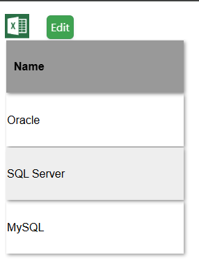
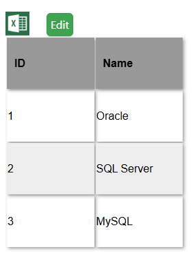
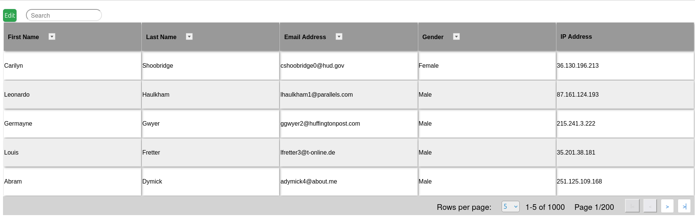
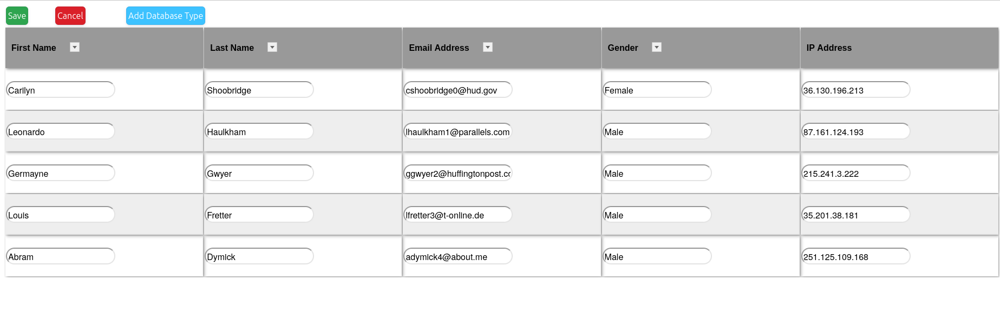
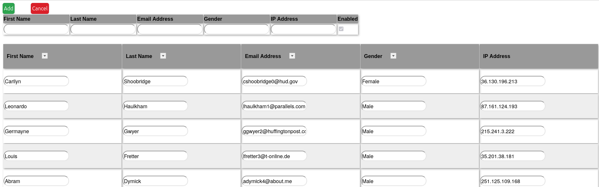
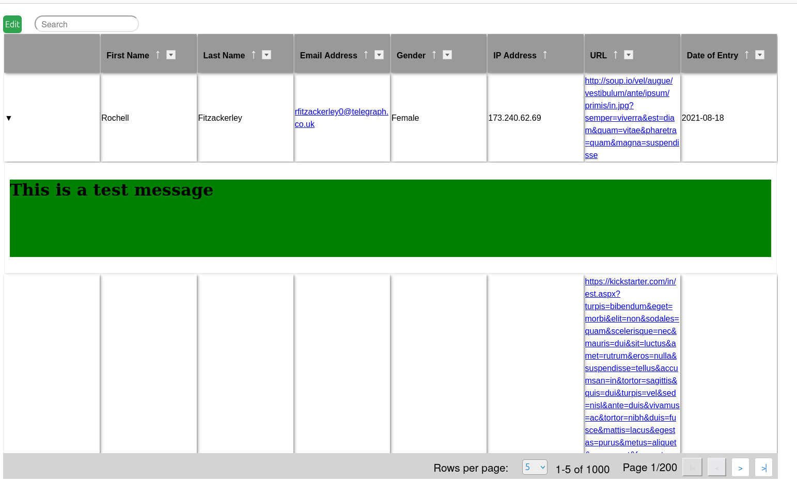
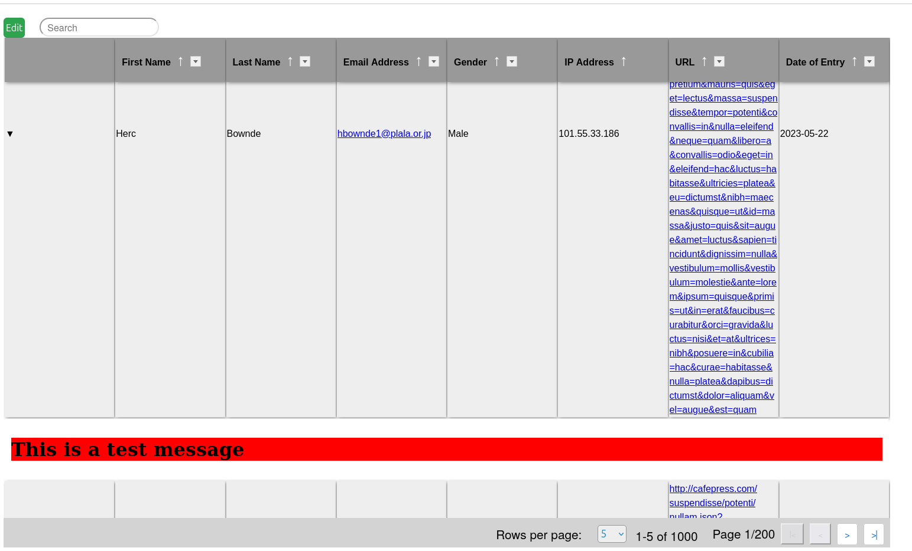
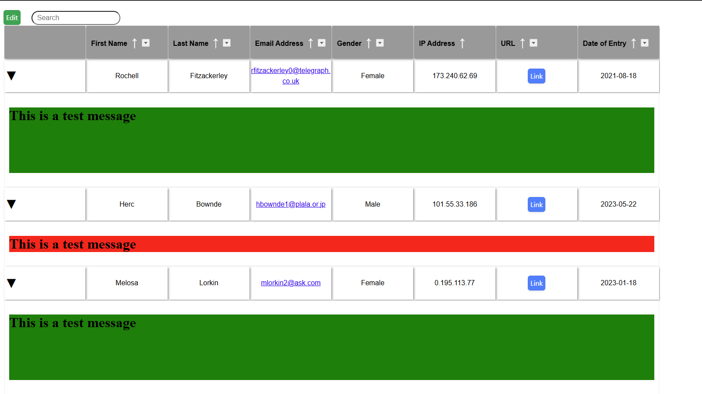

# SegiTable

### SegiTable is a simple React component that renders a data table based on an array with the data that you want to display and an object that describes your data and enabled or disables features. This table can be edited, exported and searched.

### Features:

 - Simple HTML/CSS based table
 - No external dependencies
 - Very small size
 - Table data can be edited to edit or add a row to the table
 - Built in search
 - Built in pagination
 - Built in filtering
 - Collapsible/expandable rows for either all rows or some rows based on criteria
 - Export to CSV
 - Customize the look and feel with CSS

Double clicking on the Name column shows the ID column:

Editable table with pagination

Expandable rows

Multiple Expandable rows

# Documentation:

See docs for information on using and styling SegiTable.

# Example
There is a fully working project of SegiTable in use located in example/.

# Possible issues:

1. SegiTable was written in Typescript so you will need Typescript support in your application to use it.

2. When rending SegiTable, if the data is coming from an API call, you need to make sure that the data has finished loading before rendering SegiTable. Usually this means doing

<pre>
     {dataLoaded &&
          &lt;SegiTable
               saveAddCallBackHandler={saveAddClickHandler}
               saveEditCallBackHandler={saveEditClickHandler}
               defaultPageSize={5}
               pageSizeOverride={{ 5: "5", 10: "10", 25: "25", 50: "50" }}
               height={"775px"}
               showDisabled={false}
               tableTemplate={template} /&gt;
     }
</pre>

If you do not do this, the SegiTable component will render with an empty array for the data and will show "No Data".

When a field is a select type, the SelectData property specifies the data to render for the select dropdown. You must also make sure that the SelectData object for all fields 
that are select types have been loaded. Otherwise, when you edit the table, the select dropdown will be empty. 

3. It is best to use pagination if your data has many rows and the table is editable. If you do not use pagination on an editable table, editing can be slow.

### Future features:
